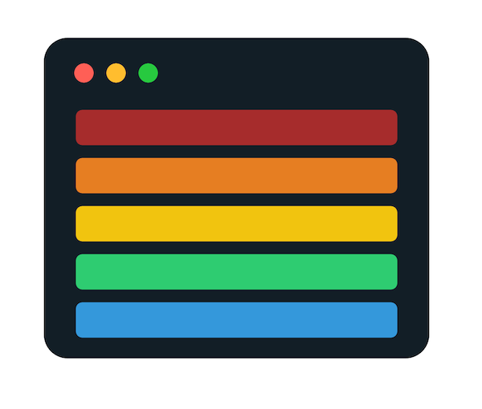
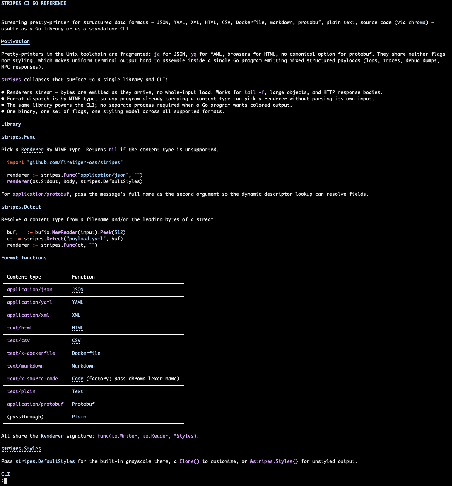

# stripes [](https://github.com/firetiger-oss/stripes/actions/workflows/ci.yml) [](https://pkg.go.dev/github.com/firetiger-oss/stripes)

<p align="center">
  
</p>

Streaming pretty-printer for structured data formats — JSON, YAML, XML, HTML, CSV, Dockerfile, markdown, protobuf, parquet, plain text, source code (via [chroma](https://github.com/alecthomas/chroma)), txtar archives, WebAssembly — usable as a Go library or as a standalone CLI.

## Motivation

Pretty-printers in the Unix toolchain are fragmented: `jq` for JSON, `yq` for
YAML, browsers for HTML, no canonical option for protobuf. They share neither
flags nor styling, which makes uniform terminal output hard to assemble inside
a single Go program emitting mixed structured payloads (logs, traces, debug
dumps, RPC responses).

`stripes` collapses that surface to a single library and CLI:

- Renderers stream — bytes are emitted as they arrive, no whole-input load. Works for `tail -f`, large objects, and HTTP response bodies.
- Format dispatch is by MIME type, so any program already carrying a content type can pick a renderer without parsing its own input.
- The same library powers the CLI; no separate process required when a Go program wants colored output.
- One binary, one set of flags, one styling model across all supported formats.

## Library

### Format sub-packages

Each format lives in its own sub-package that registers itself with the
root `stripes` package at init. Import the formats you need for their
side effects — this keeps your dependency graph free of the parsers you
don't use:

```go
import (
    "github.com/firetiger-oss/stripes"
    _ "github.com/firetiger-oss/stripes/json"
    _ "github.com/firetiger-oss/stripes/yaml"
)
```

Or import everything with the umbrella package:

```go
import _ "github.com/firetiger-oss/stripes/all"
```

| Content type                     | Sub-package  | Renderer(s)                                  |
|----------------------------------|--------------|----------------------------------------------|
| `application/json`               | `stripes/json`       | `JSON`                               |
| `application/yaml`               | `stripes/yaml`       | `YAML`                               |
| `application/xml`                | `stripes/xml`        | `XML`                                |
| `text/html`                      | `stripes/html`       | `HTML`                               |
| `text/csv`                       | `stripes/csv`        | `CSV`                                |
| `text/x-dockerfile`              | `stripes/dockerfile` | `Dockerfile`                         |
| `text/x-go-mod` etc.             | `stripes/gomod`      | `GoMod`, `GoSum`, `GoWork`, `GoVendorModules` |
| `text/markdown`                  | `stripes/markdown`   | `Markdown`                           |
| `text/x-source-code`             | `stripes/code`       | `Code` (factory; pass chroma lexer name) |
| `application/wasm`               | `stripes/code`       | `Wasm` (requires `wasm2wat` from WABT) |
| `application/protobuf`           | `stripes/protobuf`   | `Protobuf`                           |
| `application/vnd.apache.parquet` | `stripes/parquet`    | `Parquet`                            |
| `text/x-txtar`                   | `stripes/txtar`      | `Txtar` (recursive per-file dispatch) |
| `text/plain`                     | `stripes` (root)     | `Text`, `Plain`                      |

All renderers share the
[`Renderer`](https://pkg.go.dev/github.com/firetiger-oss/stripes#Renderer)
signature: `func(io.Writer, io.Reader, *stripes.Styles)`.

`.wat`/`.wast` text-format WebAssembly is detected automatically and
routed through chroma's `wat` lexer. Binary `.wasm` rendering shells
out to `wasm2wat` from [WABT](https://github.com/WebAssembly/wabt);
install via `brew install wabt` or `apt install wabt`.

### [stripes.Func](https://pkg.go.dev/github.com/firetiger-oss/stripes#Func)

Pick a [`Renderer`](https://pkg.go.dev/github.com/firetiger-oss/stripes#Renderer)
by MIME type. Returns `nil` if no imported sub-package handles the
content type.

```go
import (
    "github.com/firetiger-oss/stripes"
    _ "github.com/firetiger-oss/stripes/json"
)

renderer := stripes.Func("application/json", "")
renderer(os.Stdout, body, stripes.DefaultStyles)
```

For `application/protobuf`, pass the message's full name as the second
argument so the dynamic descriptor lookup can resolve fields.

### [stripes.Detect](https://pkg.go.dev/github.com/firetiger-oss/stripes#Detect)

Resolve a content type from a filename and/or the leading bytes of a
stream, using the filenames, extensions, magic bytes, and heuristics
registered by the imported sub-packages.

```go
buf, _ := bufio.NewReader(input).Peek(512)
ct := stripes.Detect("payload.yaml", buf)
renderer := stripes.Func(ct, "")
```

### [stripes.Register](https://pkg.go.dev/github.com/firetiger-oss/stripes#Register)

Third-party code can register additional formats by calling
`stripes.Register` with a [`Format`](https://pkg.go.dev/github.com/firetiger-oss/stripes#Format)
from an `init` function — the same mechanism the built-in sub-packages
use.

### [stripes.Styles](https://pkg.go.dev/github.com/firetiger-oss/stripes#Styles)

Pass [`stripes.DefaultStyles`](https://pkg.go.dev/github.com/firetiger-oss/stripes#DefaultStyles)
for the built-in grayscale theme, a `Clone()` to customize, or `&stripes.Styles{}`
for unstyled output.

## [stripes/table](https://pkg.go.dev/github.com/firetiger-oss/stripes/table)

Render typed iterators of struct values as styled CLI tables. Columns are
derived by reflection from exported fields: headers come from field names
(or a `table:"NAME"` tag), cell formatters from field types
(`time.Time`/`time.Duration` get dedicated formats, numerics are
right-aligned). Tag modifiers like `table:",bytes"`, `table:",count"`, and
`table:",0-100%"` pin specific formatters and suffixes.

```go
import (
    "iter"
    "os"
    "time"

    "github.com/firetiger-oss/stripes/table"
)

type Pod struct {
    Name     string
    Status   string
    Restarts int
    Memory   int64 `table:"MEM,bytes"`
    Age      time.Time
}

func render(seq iter.Seq2[Pod, error]) error {
    return table.Write(os.Stdout, seq, table.WithNow(time.Now))
}
```

`Write` / `Format` are one-shot helpers; `NewWriter[T]` / `NewFormatter[T]`
precompute the schema and are appropriate for hot loops. For non-struct
rows (`[]string`, `[]any`, …) pass [`WithColumns`](https://pkg.go.dev/github.com/firetiger-oss/stripes/table#WithColumns)
or [`WithHeaders`](https://pkg.go.dev/github.com/firetiger-oss/stripes/table#WithHeaders).
Borders, viewports/scrollbars, row selectors, and per-cell or per-row
style callbacks are available via the
[`Option`](https://pkg.go.dev/github.com/firetiger-oss/stripes/table#Option)
constructors.

## [stripes/cobra](https://pkg.go.dev/github.com/firetiger-oss/stripes/cobra)

Drop-in styled help, usage, and error output for CLIs built with
[`spf13/cobra`](https://github.com/spf13/cobra). The palette is sourced
from [`stripes.DefaultStyles`](https://pkg.go.dev/github.com/firetiger-oss/stripes#DefaultStyles)
so help text matches the rest of the project's output. ANSI is downgraded
or stripped automatically when stdout/stderr is not a terminal.

```go
import (
    "context"
    "errors"
    "os"

    "github.com/spf13/cobra"

    stripescobra "github.com/firetiger-oss/stripes/cobra"
)

func main() {
    root := &cobra.Command{
        Use:   "mytool",
        Short: "A demo CLI",
    }
    root.PersistentFlags().StringP("config", "c", "/etc/mytool.cfg", "config `file` path")

    root.AddCommand(&cobra.Command{
        Use:   "serve",
        Short: "Start the server",
        RunE: func(*cobra.Command, []string) error {
            return errors.New("not implemented")
        },
    })

    if err := stripescobra.Execute(context.Background(), root); err != nil {
        os.Exit(1)
    }
}
```

[`Execute`](https://pkg.go.dev/github.com/firetiger-oss/stripes/cobra#Execute)
installs styled help/usage/error rendering on `root` and every subcommand
before calling `root.ExecuteContext`. Use
[`Apply`](https://pkg.go.dev/github.com/firetiger-oss/stripes/cobra#Apply)
to install the renderers without running the command. The palette,
output writers, and error handler are overridable via
[`WithStyles`](https://pkg.go.dev/github.com/firetiger-oss/stripes/cobra#WithStyles),
[`WithOutput`](https://pkg.go.dev/github.com/firetiger-oss/stripes/cobra#WithOutput),
[`WithErrorOutput`](https://pkg.go.dev/github.com/firetiger-oss/stripes/cobra#WithErrorOutput),
and [`WithErrorHandler`](https://pkg.go.dev/github.com/firetiger-oss/stripes/cobra#WithErrorHandler).

## CLI

```
go install github.com/firetiger-oss/stripes/cmd/stripes@latest
```

```
$ stripes --help
Usage: stripes [flags] [file...]

Pretty-print structured data (JSON, YAML, XML, HTML, CSV, Dockerfile, markdown,
protobuf, parquet, text, source code, txtar, wasm) with ANSI colors and optional paging.

When multiple files are given, each is preceded by a centered rule
(───── filename ─────) so the source is visible inline. --format,
--content-type, and --schema apply to all of them.

Flags:
  -f, --format string         json|yaml|xml|html|csv|dockerfile|markdown|text|code|protobuf|parquet|txtar|wasm|table|auto (default auto)
                              "table" routes CSV/TSV/JSONL/parquet through the
                              new typed-table renderer with width-fitting,
                              JSON-cell colorization, and (for parquet) schema-
                              driven column formatting.
      --content-type string   Override MIME type (e.g. application/vnd.foo+json)
      --schema string         Schema URL (protobuf full name)
      --color string          always|never|auto (default auto)
      --paging string         always|never|auto (default auto). In "auto",
                              the pager is spawned only when the rendered
                              output is wider or taller than the terminal,
                              or when more than one file is rendered.
      --profile string        Color profile name or path. Bare names resolve
                              against $XDG_CONFIG_HOME/stripes/profiles
                              (~/.config/stripes/profiles) and the built-in
                              set. A value containing "/" or ending in
                              .yaml/.yml is loaded as a file directly.
  -w, --width int             Output width in columns. 0 (default) =
                              auto-detect from the terminal; falls back
                              to no wrap when stdout is not a TTY.
  -p, --pager string          Pager command (e.g. "less -R", "bat --plain").
                              Use --paging=never to bypass paging.
  -n, --line-numbers          Show line numbers in a left-aligned gutter.

Pager resolution: -p flag > $STRIPES_PAGER > $PAGER > "less -R"
Profile resolution: --profile flag > $STRIPES_PROFILE > built-in default
Color is auto-disabled when NO_COLOR is set or stdout is not a terminal.
```

### Shell aliases

```sh
alias scat='stripes'                 # auto-paging: pages only when content overflows
alias spcat='stripes --paging=never' # always-stream, never page
```



## Contributing

Contributions are welcome! To get started:

1. Ensure you have Go 1.25+ installed
2. Run `go test ./...` to verify tests pass

Please report bugs and feature requests via [GitHub Issues](https://github.com/firetiger-oss/stripes/issues).

## License

This project is licensed under the MIT License - see the [LICENSE](LICENSE) file for details.
